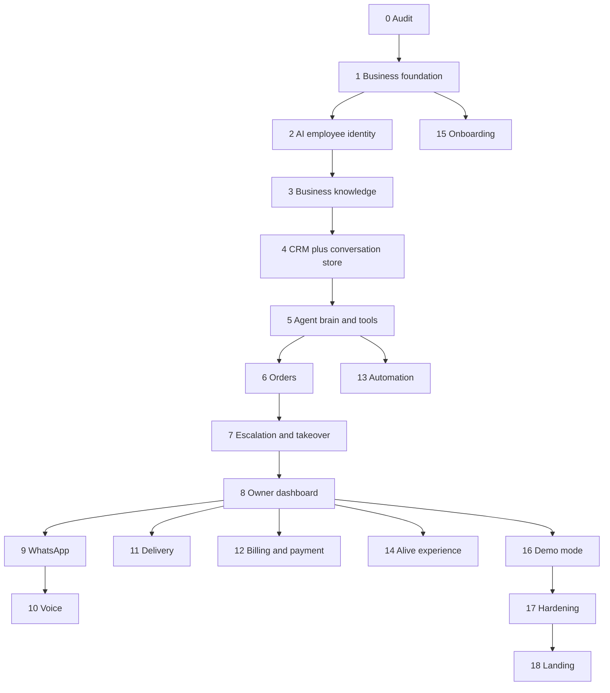

# Aurel MVP roadmap

The product is an **employee who owns a request until completion**, not a chatbot that replies.

**Do not start Phase 18 (landing/acquisition) until Phases 1–8 work with real data and a mock customer channel.**

Demo tenant (explicit demo mode only): Sharma Electricals.

---

## Phase map

---

## PHASE 0 — Architecture + audit

**Status:** done (this folder).

**Exit:** `docs/ARCHITECTURE.md` + this file. No product features.

---

## PHASE 1 — Product foundation

**Depends on:** 0  
**Exit:** a real business can exist in the DB with membership, settings, hours, audit, tenant isolation tests.

Build:

- Prisma + Postgres + migrations
- `Business`, `User`, `Employee`, `BusinessMembership`, `BusinessSettings`, `BusinessHours`, `Integration`, `AuditLog`
- APIs: `POST/GET/PATCH /api/business`, `GET/PATCH /api/business/settings`
- Mobile-friendly onboarding wizard (name → type → location → phone → languages → hours → create AI employee)
- Auth session + role checks
- Tenant isolation tests (two businesses, no cross-read)
- `docs/IMPLEMENTATION_STATUS.md`

No fake catalog. No Sharma seed yet.

---

## PHASE 2 — AI employee identity

**Depends on:** 1  
**Exit:** owner sees “I hired Rahul”, not an LLM console.

Build:

- `/app/ai-employee` profile: name, avatar, working/paused, languages, today’s counts from **real** queries (zeros until later phases)
- What they handle / when they ask you / current activity / recent work / performance
- Settings: name, avatar, tone, languages, hours, responsibilities, escalation rules
- No tokens, RAG, embeddings in the owner UI
- Tests for employee type `AI` scoped by `business_id`

---

## PHASE 3 — Business knowledge

**Depends on:** 1 (identity can stay parallel but products need tenant)  
**Exit:** hybrid product search with confidence; CSV import preview; no silent bad imports.

Build:

- `KnowledgeDocument`, `KnowledgeChunk`, `KnowledgeSource`, `KnowledgeVersion`
- `Product`, `ProductAlias`
- Search: exact SKU, keyword, alias, then semantic (start with token/alias scoring; embeddings when justified)
- Confidence; multiple candidates instead of a guess
- `/app/knowledge`, `/app/products`
- CSV import preview (missing prices, duplicate SKUs)
- Tests: `Philips ka 12 watt wala` → `PHILIPS-LED-12W`; ambiguous query does not auto-pick

---

## PHASE 4 — Customer conversations (CRM + store)

**Depends on:** 1  
**Exit:** phone maps to one customer per business; conversation + messages persist; profile shows real history.

**4a CRM**

- `Customer`, `CustomerAddress`, `CustomerPreference`, `CustomerTag`, `CustomerNote`, `CustomerInteraction`
- Identify by phone inside `business_id`
- `/app/customers/[id]` — info, orders (empty until Phase 6), notes, AI summary from **actual** fields
- Isolation tests

**4b Conversation engine (store, not yet a smart agent)**

- `Conversation`, `Message`, `MessageAttachment`, `ConversationParticipant`, `ConversationSummary`
- Channels: `WHATSAPP` | `PHONE` | `WEB` | `INTERNAL`
- Message types: `TEXT` | `VOICE` | `IMAGE` | `DOCUMENT` | `SYSTEM`
- Control mode: `AI` | `HUMAN` (takeover wired in Phase 7)
- Internal/web mock inbox so we can inject messages **without WhatsApp**

Phase 4 does **not** require a clever planner. It must store and display threads.

---

## PHASE 5 — Agent brain + tools

**Depends on:** 2, 3, 4  
**This is the product. Do not skip ahead to WhatsApp or the landing page.**

**Exit:** inbound text → planner → tools → verified reply → DB updated. No invented prices. Prompt injection refused by tools.

Build:

- Tool registry with permissions and risk classes
- Orchestrator (demo planner without API key; LLM provider when keyed)
- Language detection: Hindi / English / Hinglish
- Sentiment (at least angry vs not) for later escalation
- Action log (`AIAction`)
- Cost/usage row per call (even if rupees are estimated later)
- Tests: golden enquiry; low-confidence clarify; injection attempt cannot read another tenant

---

## PHASE 6 — Orders

**Depends on:** 5  
**Exit:** draft → completeness → customer confirm → `CONFIRMED`. No confirm if stock/price/address missing.

Build:

- Order state machine (full enum in schema; MVP enforces draft/pending info/pending confirm/confirmed/escalated/cancelled)
- Completeness: `{ complete, missing[] }`
- Prices only from catalog / pricing rules
- Confirmation summary before confirm
- Tests: missing qty, missing address, inventory short, ambiguous product

---

## PHASE 7 — Human escalation

**Depends on:** 5, 6  
**Exit:** refund/anger/unknown/high-risk creates a structured ticket; human takeover mutes AI; return-to-AI loads updated context.

Build:

- `Escalation`, `CallbackTask`
- Priorities and SLA fields (timers can be naive at first)
- AI summary for humans (not “read the whole chat first”)
- `/app/escalations`
- Tests: angry + refund → escalation; takeover stops AI replies

---

## PHASE 8 — Owner dashboard

**Depends on:** 5–7  
**Exit:** overview numbers come from the database, not placeholders.

Build:

- `/app` — AI handled today, needs attention, opportunities, employee status
- Lists: conversations, orders, escalations (simple, mobile-first)
- Daily briefing as a query over today’s rows
- Still **not** the public marketing site

---

## PHASE 9 — WhatsApp

**Depends on:** 5–8 (loop proven on mock/web)  
**Exit:** `MessagingProvider` send/receive/media; mock remains; one official Cloud API adapter behind env.

No unofficial WhatsApp clients.

---

## PHASE 10 — Voice

**Depends on:** 9 (or at least 5 + STT text into the same orchestrator)  
**Exit:** `VoiceProvider` interface + one mock; Hindi/English/Hinglish short turns; transfer-to-human stub.

---

## PHASE 11 — Delivery

**Depends on:** 6  
**Exit:** quote → confirm → book only after provider success; tracking updates; failure does not say “booked”.

---

## PHASE 12 — Billing / payment

**Depends on:** 6  
**Exit:** quotation/invoice/receipt records; send only after messaging provider OK; Razorpay-shaped mock; screenshot ≠ paid; GST fields present, no tax advice.

---

## PHASE 13 — Automation

**Depends on:** 5, 6  
**Exit:** event → action table (follow-up, notify owner). Frequency caps. No blast WhatsApp.

---

## PHASE 14 — AI employee “alive” experience

**Depends on:** 8  
**Exit:** profile shows live activity, recent work, working/paused, action log the owner can trust.

---

## PHASE 15 — Onboarding

**Depends on:** 1, 2; catalog import from 3  
**Exit:** wizard + CSV path; AI employee named at the end.

---

## PHASE 16 — Demo mode

**Depends on:** 8 (and ideally 9 mock)  
**Exit:** `DEMO_MODE` seeds Sharma Electricals (products, customers, orders, threads, escalations). Never mix into a real tenant.

---

## PHASE 17 — Production hardening

**Depends on:** 16  
**Exit:** webhook signatures, rate limits, structured logs, CI tests (isolation, injection, golden path), env validation.

---

## PHASE 18 — Landing + acquisition

**Depends on:** 17  
**Exit:** public marketing page. **Last.**

---

## Explicitly out of order (do not do these first)

- Pretty landing, SEO, pricing page
- Real WhatsApp before the tool loop works locally
- Porter/Razorpay before mocks
- Festival marketing, bulk campaigns
- Owner voice assistant (after customer voice, if ever in MVP)

---

## Prompt sequence (engineering)

| Prompt | Phase |
|---|---|
| 1 Audit | 0 |
| 2 Business foundation | 1 |
| 3 AI employee identity | 2 |
| 4 Knowledge + products | 3 |
| 5 Customer CRM | 4a |
| 6 Conversation engine | 4b |
| (next) Agent tools | 5 |
| (next) Orders | 6 |
| (next) Escalation | 7 |
| (next) Owner dashboard | 8 |

After Prompt 6, continue 5→8 before WhatsApp.
